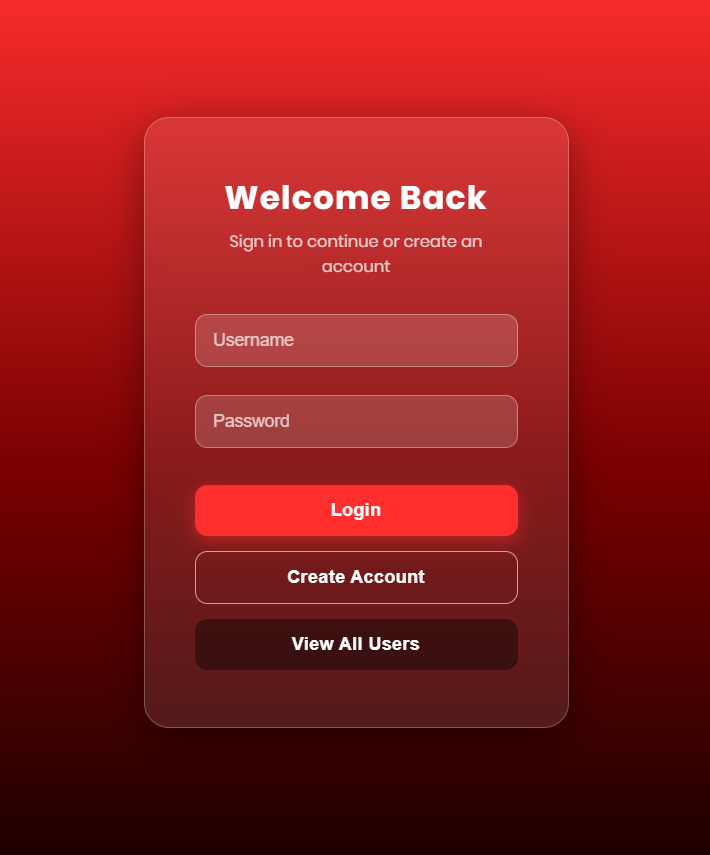

# 🔐 Login & Signup Page

A simple, responsive **login and signup page** built using **HTML & CSS**, developed in **Eclipse IDE**. It features a modern **red gradient glassmorphism** design with a clean, centered card layout.

---

## ✨ Features

- 🎨 Red gradient background (top red → bottom dark shade)
- 🧊 Glassmorphism-style card with blur effect
- 📱 Fully responsive, centered layout
- 🔘 Login, Signup, and Display buttons
- ⚡ Smooth hover and focus animations on inputs & buttons

---

## 🛠️ Tech Stack

- **HTML5** – page structure
- **CSS3** – styling, gradients, glass effect, animations
- **Eclipse IDE** – development environment

---

## 📂 Project Structure

login-signup-page/
├── src/main/webapp/
│   ├── index.html      # Main login/signup UI
│   └── ...
├── .classpath
├── .project
└── README.md

---

## 🚀 How to Run

1. Clone the repository
   git clone https://github.com/sherinjessie/login-signup-page.git

2. Open the project in **Eclipse IDE** (or any IDE of your choice)
3. Open `index.html` in a browser, or run it on a local server (e.g. Tomcat, Live Server)

---

## 📸 Preview

---

## 👩‍💻 Author

**Sherin Jessie W.**
Final year CSE (AI & ML) student | Learning Full Stack Development

---

## 📄 License

This project is open source and free to use for learning purposes.
